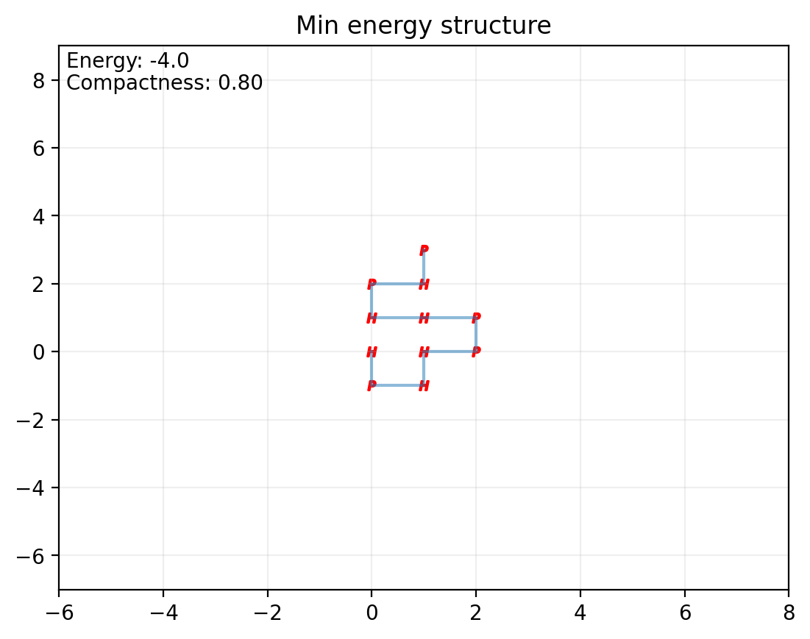
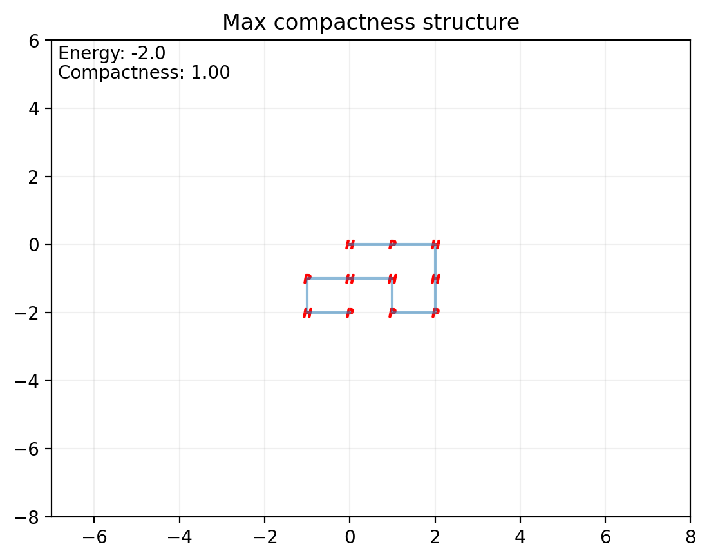
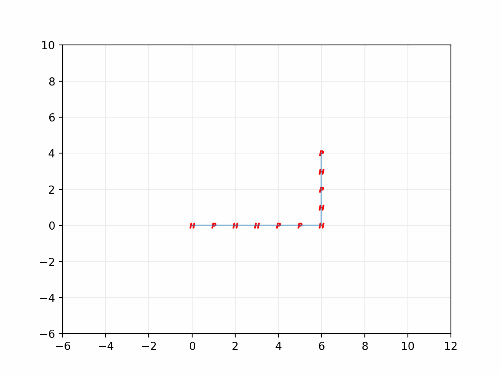
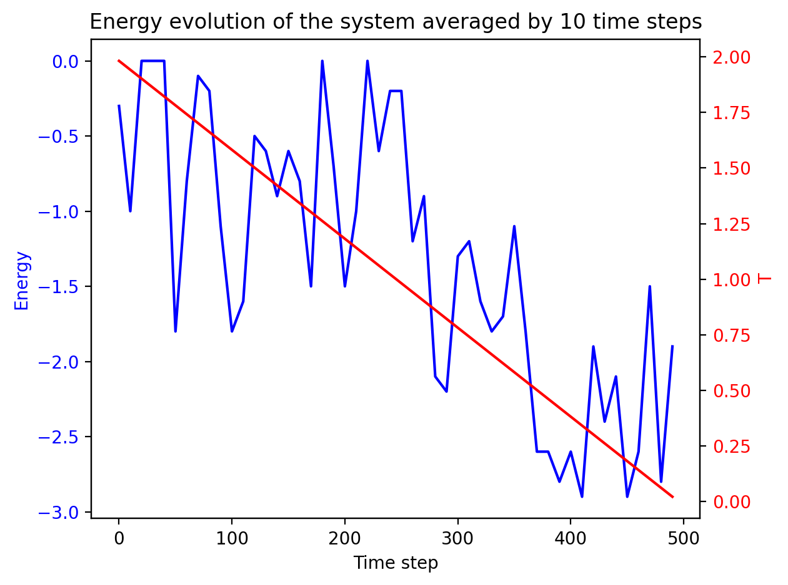
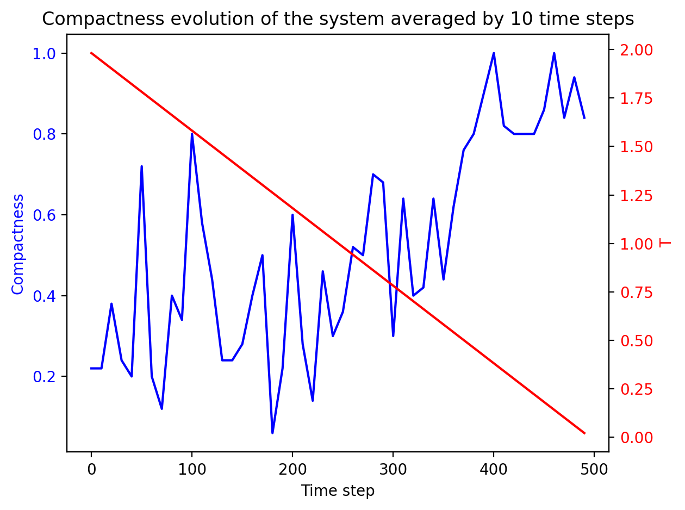

# HP model for protein folding

In this project I implemented in Python the HP model for protein folding.
The HP model is a simple model that can help to understand basic folding behaviours of proteins using Monte Carlo simulation over the free energy of the bounds. It approximate the protein sequence with only two category of aminoacids, H (hydrophobic) and P (polar). For more info look at [this](https://pubs.acs.org/doi/10.1021/ma00200a030) paper or at the [paragraph](https://github.com/TommyGiak/HP_model#some-theory) below.\
I created a command line application that can take the sequence of a protein (even with the 20 distinct aminoacids) and can run a HP model simulation of the folding process of the protein at given temperatures using, optionally, annealing algorithms and giving as outputs the energy evolution of the system, the structure of the protein the native structure energy (or the minimum energy configuration founded) and the compactness.\
This project can be used to have a first impact of the behaviour of a protein and can be used to study the transitions to native states of proteins as function of temperature and bounding energy. Can be also done different test and comparison, for example seeing the different behaviours of similar proteins when two random adjacent aminoacids are switched.

## Table of contents

1. [Install and run the code](https://github.com/TommyGiak/HP_model#install-and-run-the-code)
2. [Parameters setting](https://github.com/TommyGiak/HP_model#parameters-setting)
    1. [Insert the protein sequence](https://github.com/TommyGiak/HP_model#insert-the-protein-sequence)
    2. [Change the number of folding steps](https://github.com/TommyGiak/HP_model#change-the-number-of-folding-steps)
    3. [All the other parameters](https://github.com/TommyGiak/HP_model#all-the-other-parameters)
    4. [Create a personalized configuration file](https://github.com/TommyGiak/HP_model#create-a-personalized-configuration-file)
3. [Repository structure](https://github.com/TommyGiak/HP_model#repository-structure)
4. [Some theory](https://github.com/TommyGiak/HP_model#some-theory)
    1. [Algorithm for the protein folding](https://github.com/TommyGiak/HP_model#algorithm-for-the-protein-folding)
    2. [Acceptance of the structure](https://github.com/TommyGiak/HP_model#acceptance-of-the-structure)
5. [Execution example](https://github.com/TommyGiak/HP_model#execution-example)

## Install and run the code

From _terminal_ move into the desired folder and clone this repository using the following command:

```shell
git clone https://github.com/TommyGiak/HP_model.git
```

Once the github repository is cloned use the following command to run the script with the default configuration file as input:

```shell
python main.py
```

the default configuration file is _config.txt_. Of course all the parameters can be setted, for further instruction look at the following [paragraph](https://github.com/TommyGiak/HP_model#parameters-setting).\
To use a specific configuration file, instead, use:

```shell
python main.py <filename>
```

To create a personalized configuration file look [here](https://github.com/TommyGiak/HP_model#create-a-personalized-configuration-file)\
The requirement to run this application are:

- [python 3](https://www.python.org)
- [numpy](https://numpy.org)
- [matplotlib](https://matplotlib.org)

## Parameters setting

To change the protein sequence, the structure and the other parameters you can modify the _config.txt_ file or create a configuration file exnovo as described below.

### Insert the protein sequence

The protein sequence can be written in the _config.txt_ file at the _sequence_ variable. The sequence is caps sensitive so the letters must be upper case only. The sequence doesn't need the quotation marks " or ' .\
This sequence can be already given as H/P only monomers (hydrophobic or polar) or with the 20 different amino-acids coded upper case, is this case the sequence will be converted to H/P.

### Change the number of folding steps

The number of folding steps can be setted in the _config.txt_ file at the _folding\_step_ variable.

### All the other parameters

The other options are:

- choosing if use annealing algorithm or not, setting _annealing_ TRUE or FALSE.
- using a specific initial structure for the protein, setting _use_structure_ TRUE and inserting a correct structure in _structure_
- set the initial temperature, using the variable _T_. If the variable _annealing_ is TRUE the temperature decreases linearly to zero during the evolution of the protein, in the other case the temperature remains constant.
- create or not the gif of the process at the and of the evolution, using the variable _create_gif_ TRUE or FALSE.
- random seed selection: you can specify the random seed to use or insert _seed = None_ to generate a random one that will be printed when the starting of the simulation.

### Create a personalized configuration file

To create a personalized configuration file you can just copy the syntax of the _config.txt_ changing the parameters as you prefer. To use it in the simulation follow the instruction [here](https://github.com/TommyGiak/HP_model#install-and-run-the-code).\
The new configuration file can have any extension.

## Repository structure

The repository contain these pyhton files:

- _main.py_: runs the evolution and save the results in the _/data_ folder
- _protein_class.py_: contains a class named `Protein` which contains and save the protein information and implement all the main function for the evolution of the system
- _utils.py_: contains different functions to validate the structures of the proteins and to support the evolution of the protein, including reordering of the input file configurations
- _plots.py_: contains funtion to plot the results
- _test.py_: contains the test functions to test the code
- _config.txt_: contains the information needed by the program as input
- _config_test.txt_: contains the information to start the test of the application; just to be sure to don't have problems, I suggest you to don't modify it. To run the test is sufficient to write from terminal, inside the cloned repository, "pytest test.py" (pytest is required).

## Some theory

As already mentioned before, the HP model for protein folding is a model for protein folding that simplifies the complex process of predicting protein structures by focusing on two types of amino acids: hydrophobic (H) and polar (P). It assumes that hydrophobic amino-acids cluster together inside the protein to avoid water, while polar amino acids are on the protein's surface. This model is a useful educational tool to teach the basics of protein folding but is highly simplified compared to real protein folding, which involves many other factors and interactions. Researchers often use more sophisticated models for accurate predictions.

### Algorithm for the protein folding

The algorithm for the protein folding is implemented in the `Protein` class in the _protein_class.py_ file, with the support of some more generic function in the _utils.py_ file.\
Each folding step involve the following steps:

1. choose a random monomer in the protein: a random integer from $0$ to $l-1$ where $l$ is the lenght of the protein sequence. The sampled monomer will be the starting point for the movement of the protein.
1. sample a random integer in $[1,8]$ to randomly select a type of move, the movement are implemented in the function [`tail_fold`](https://github.com/TommyGiak/HP_model/blob/main/utils.py) in the _utils.py_ file. The movement are: 1 = 90° clockwise rotation, 2 = 90° anticlockwise rotation, 3 = 180° rotaion, 4 = x-axis refletion, 5 = y-axis reflection, 6 = 1 and 3 quadrant bisector symmetry, 7 = 2 and 4 quadrant bisector symmetry and 8 = movement on a digaonal of a random monomer. The movement can also be choosen a priori, if it is not specified a random one is selected.
1. the new protein is validated: if the protein sequence overlap (or the distance between neighbours is different from one) the process restart from the step 1.
1. if the protein structure is valid the new structure (the folded protein) is passed.

### Acceptance of the structure

Once a new structure is generated by a folding step, the energy of this new structure is computed and the acception follows the Metropolis algorithm.\
If the energy of the new protein structure is less than the previous one, the new structure is always accepted, if instead the energy is grater the new structure is accepted with probability:

```math
p = e^{-\frac{\Delta E}{k_bT}}
```

where $\Delta E > 0$.\
__N.B.__ I approximate $k_b = 1$ for semplicity so, in this application, when appears a temperature $T=c$, it actually means $k_b T = c$.

## Execution example

As example I used a simulation for a the protein sequence of Myoglobin (Camelus dromedarius) taken from [here](https://www.ncbi.nlm.nih.gov/protein/KAB1270346.1?report=fasta).
I simulated 100000 folding steps as indicated in the _config.txt_ file.
I started the simulation with $T = 2.0$ and I used annealing.\
The whole process took $\sim 12$ min, quite a long time since the protein il relatively long and the folding steps may are more than necessary. In any case runtime depend on the PC that you are using.\
The results are also present in the [data folder](https://github.com/TommyGiak/HP_model/tree/main/data), anyway, starting with a linear structure, I obtained the following results:

- energy minimum:


- compactness maximum:


- evolution process:


- energy evolution profile:


- compactness evolution profile:


It is easy to see from the plots how the energy and the compactness stabilize when the temperature $T$ reach $\sim 0.5$.
To notice also that lowest energy does not correspond to highest compactness.
